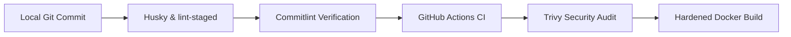
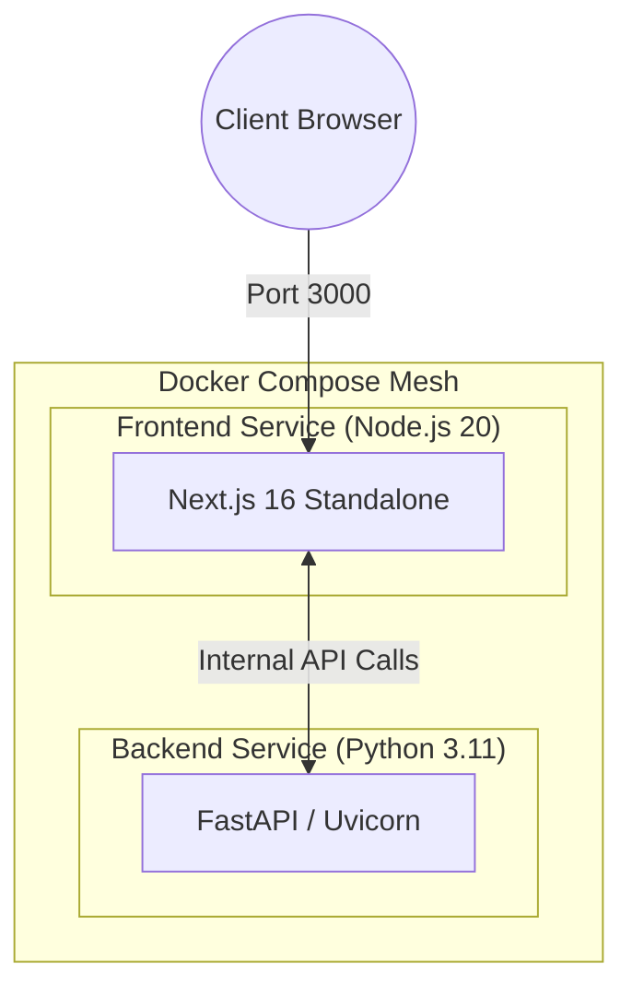

# Deterministic DevOps Template

<div align="center">
  
  
  
  
  
  
  <br />
  <br />
  <a href="https://cvneren.github.io/deterministic-devops-template/docs/index.html">
    
  </a>
  <br />
  <br />
</div>

## The Challenge & The Solution

### The Challenge

Modern software development is frequently compromised by "it works on my machine" syndromes, bloated container images, and fragmented CI/CD pipelines. Security is often treated as a post-deployment afterthought, leading to unpredictable environments and containers that carry high-severity vulnerabilities into production.

### The Solution

This boilerplate enforces a **deterministic, zero-trust engineering environment**. By implementing strict local quality gates (Shift-Left) through Husky and lint-staged, and mandatory build-time security auditing via Trivy, this architecture ensures that code cannot be committed or built unless it is verified, formatted, and hardened against known CVEs.

## Architecture & Pipeline

### CI/CD Pipeline Lifecycle

This project utilizes a multi-layered verification strategy to ensure that only compliant and secure code can be built.



### System Architecture

The application is architected as an isolated monorepo. Both services utilize Multi-Stage Docker builds to minimize runtime footprints and eliminate build-time tools (like `npm` and `pip`) from the final images.



## Getting Started

### Local Development

The project utilizes Docker Compose to orchestrate local development, complete with live-reloading and internal networking.

To start the local environment, execute:

```bash
docker-compose up --build
```

- **Frontend:** Accessible at `http://localhost:3000`
- **Backend (API):** Accessible at `http://localhost:8000`

### Committing Code (Git Hooks)

Ensure you have installed the root dependencies to initialize the local Git Hooks:

```bash
npm install
```

When creating a commit, Husky will automatically intercept the process to run Prettier, ESLint, and Commitlint against your staged files. Your commit message must adhere to the Conventional Commits specification:

```bash
# Example of a valid commit
git commit -m "feat: setup initial authentication middleware"
```

## Core Engineering Pillars

The design of this repository is informed by DORA "Elite Performer" metrics and NIST security standards. For an exhaustive, data-driven justification of these patterns, refer to the [Architecture Specification](./docs/ARCHITECTURE_SPEC.md).

| Pillar / Feature             | Implementation                       | Engineering Benefit                                                                                                                                                 |
| :--------------------------- | :----------------------------------- | :------------------------------------------------------------------------------------------------------------------------------------------------------------------ |
| **Shift-Left Security**      | Husky & lint-staged                  | Enforces formatting, linting, and quality checks locally before commit; saves CI compute and reduces reviewer fatigue.                                              |
| **Deterministic History**    | Conventional Commits & `@commitlint` | Mandates machine-readable history; enables automated Semantic Versioning (SemVer) and automated changelog generation.                                               |
| **Immutable Guardrails**     | GitHub Actions & Trivy Scan          | Acts as the final gatekeeper; ensures every PR is linted, built, and scanned for CVEs before merging to `main`.                                                     |
| **Attack Surface Reduction** | Multi-Stage Docker Builds            | Physically removes package managers (npm, pip) and build tools from production images; reduces image size by ~90% and eliminates entire classes of vulnerabilities. |

## Monorepo Structure

```text
.
├── .github/workflows/      # CI/CD Pipeline definitions (GitHub Actions)
├── .husky/                 # Git Hook configurations for Shift-Left enforcement
├── backend/                # FastAPI (Python 3.11) Service
│   ├── app/                # Application source code
│   └── Dockerfile          # Multi-stage hardened production build
├── docs/                   # Architecture & DORA metrics specifications
├── frontend/               # Next.js 16 (TypeScript) Service
│   ├── src/                # Application source code
│   └── Dockerfile          # Multi-stage standalone production build
├── docker-compose.yml      # Local development orchestration
└── package.json            # Root dependency management & DevOps scripts
```

## Tech Stack

### Frontend

- **Framework:** Next.js (App Router)
- **Language:** TypeScript
- **Styling:** Tailwind CSS
- **Containerization:** Node.js Alpine (Multi-Stage standalone output)

### Backend

- **Framework:** FastAPI
- **Language:** Python 3.11
- **Server:** Uvicorn
- **Containerization:** Python Slim (Multi-Stage wheel compilation)

### CI/CD & Pipeline Infrastructure

- **Orchestration:** Docker Compose
- **CI/CD Platform:** GitHub Actions
- **Container Security:** Trivy Vulnerability Scanner
- **Local Enforcement:** Husky, lint-staged, commitlint, Prettier, ESLint
